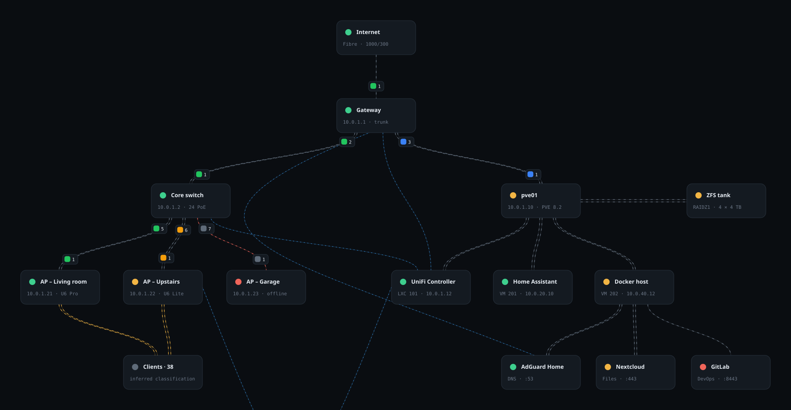

<div align="center">


# Ultimate Network Assister

**A read-only surveyor and advisor for Proxmox VE and UniFi Network estates.**

It reads what is actually there, says how it knows, and refuses to guess.

[](LICENSE)
[](CHANGELOG.md)
[](#installing)

</div>

---

<div align="center">



<sub>The topology view. This picture is produced by the application's own layout
and routing code (<code>npm run preview:media</code>), not traced by hand — the
tier ordering, the detours around cards and the port chips are the ones you get
on screen.</sub>

</div>

---

## What it is

A desktop application that connects to the systems you already run, reads them
without changing anything, and turns what it found into a picture, a set of
findings, and a change plan you carry out yourself.

It is built around one rule, and the rule shows up everywhere in the interface:

> **Say what was measured. Say what was inferred. Say what could not be
> established. Never present the third as the first.**

A firewall rule read from a controller's configuration is not evidence that the
rule takes effect, so the application marks it *unverified* even though it read
it cleanly. A backup job on a schedule is not evidence that backups exist, so
coverage is judged by the files that were actually found. Proxmox does not record
restore tests, so the restore column says *unprovable* rather than showing a
number that would look like proof.

## What it does

| | |
| --- | --- |
| **Survey** | Reads Proxmox VE and UniFi Network over their APIs. Nodes, storages, guests, interfaces, disks, devices, ports, networks, WLANs, firewall rules, clients, backup jobs and backup files. Every call is a `GET`. |
| **Topology** | Draws the estate tier by tier, with cables ordered so they do not cross, routed around the cards in between, and labelled with the port each end lands on — coloured by negotiated link speed. |
| **Overview** | Headline counters, capacity, and the findings the survey supports. When a figure could not be read, it says so and why. |
| **Advice** | Change plans derived from the survey: what is wrong, how it was measured, what to do, how to check it worked, and how to undo it. Exportable as a Markdown checklist. |
| **Backup & recovery** | Backup coverage judged from evidence, not from configuration. |
| **Deployment planner** | Blueprints resolved into a plan and rendered as a step-by-step guide, with a dry run, gates, a journal and a rollback for the parts it can apply. |
| **SSH** | Sessions bound to a saved system, with host-key pinning and a command policy enforced natively. |
| **Knowledge** | The reference material the findings point at. |

Hungarian and English throughout, switchable at runtime.

## Safety

This application is deliberately restricted, and the restrictions are in the code
rather than in the documentation.

**Reading is read-only.** The collectors issue nothing but `GET`. A read-only
Proxmox token (`PVEAuditor` is enough) and a read-only UniFi account are all it
asks for.

**Writing has an allowlist of two.** The apply pipeline can write UniFi networks
and port *profiles*, and nothing else. It never writes per-port overrides: a
wrong override cuts the controller's own uplink, and there is no way back from
inside the application.

**SSH commands are classified natively.** Read-only commands run freely. A
mutating command requires you to confirm that exact command text. Destructive
storage and availability commands — `mkfs`, `wipefs`, `dd`, `zpool destroy`,
`shutdown` and their kin — are never run by the application at all, only shown
to you. The badge you read and the rule that runs are the same answer, because
the interface asks the policy rather than deciding for itself.

**Credentials never touch the project's own storage.** They live in the Windows
Credential Manager. Snapshots hold measurements, never secrets.

**First contact is pinned.** TLS certificates and SSH host keys are pinned on
first use and checked afterwards; a changed key is reported rather than
silently accepted.

## Installing

Windows, built from source. You need [Node.js](https://nodejs.org/) 20 or newer
and a [Rust toolchain](https://rustup.rs/).

```bash
git clone https://github.com/DanSketic/Ultimate-Network-Assister.git
cd Ultimate-Network-Assister
npm install
npm run tauri:build
```

The installer lands in `src-tauri/target/release/bundle/`.

To run it from source instead:

```bash
npm run tauri:dev
```

The browser build (`npm run dev`) is useful for working on the interface, but it
shows the sample estate only: surveys, SSH and credential storage all need the
desktop shell.

## Connecting it to your systems

**Proxmox VE.** Create an API token under *Datacenter → Permissions → API
Tokens* and give it the `PVEAuditor` role on `/`. Granting it on `/nodes` alone
is not enough: Proxmox filters `/nodes/{node}/storage` per store by the caller's
rights, so a token without `Datastore.Audit` on `/storage` is answered with an
empty list rather than an error, and the capacity figures quietly go missing
while everything else succeeds. The application detects this case and says so.

**UniFi Network.** A local account with read-only rights, or an API key. The site
name is the one in the controller's URL, usually `default`.

Both are added under **Survey → Connection profiles**. The certificate is shown
to you and pinned when you accept it.

## Verifying it

The checks that matter here are not unit tests of functions but measurements of
the things that were hard to get right and easy to break again.

```bash
npm test
```

| Check | What it measures |
| --- | --- |
| `topology-crossings` | Cables that cross, cables that run through a card, and the tightest gap between two cables |
| `topology-order` | Crossings before and after tier ordering |
| `topology-fit` | That fitting frames everything, and stays centred on the devices |
| `routing-cost` | That re-styling on hover stays inside one frame |
| `advice` | That every rule fires only on measured evidence, and that execution is never reported as done |
| `capacity` | The four states of the capacity panel, including the one that used to show nothing |
| `preset-languages` | That switching language moves the untouched fields and leaves typed values alone |
| `dictionaries` | That both languages say the same thing, with shared technical terms listed rather than guessed |
| `dead-controls` | That nothing on screen looks interactive but is wired to nothing |

The Rust side has its own tests, including the SSH command policy:

```bash
cd src-tauri && cargo test
```

### What is and is not proven

The collectors have been exercised against real Proxmox VE and UniFi Network
systems. The advice rules and the capacity states have been exercised against
constructed snapshots, not against every real estate — the logic is verified,
but which rules speak on your network is something your first survey will show.

## Documentation

- [CHANGELOG.md](CHANGELOG.md) — every release and what changed in it
- [CONTRIBUTING.md](CONTRIBUTING.md) — how the code is written and what a change
  is expected to carry
- [docs/architecture.md](docs/architecture.md) — how a measurement becomes a
  picture, and where the safety boundaries sit

## Screenshots

Captures of the running desktop application live in
[`docs/media/screenshots/`](docs/media/screenshots/), which also says which
views are worth capturing and what to check before committing one. Everything
else in the documentation is generated from source — `npm run icons` for the
application icon, `npm run preview:media` for the topology view above — so it
cannot drift from what the code actually draws.

## Licence

[MIT](LICENSE) © Dan
